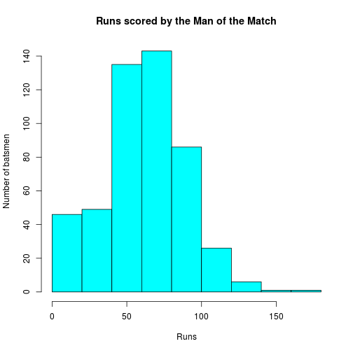
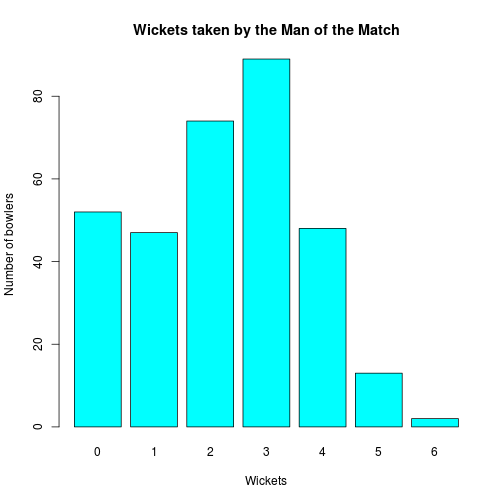
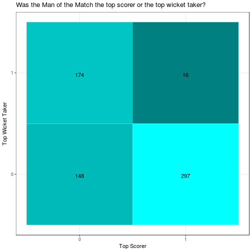
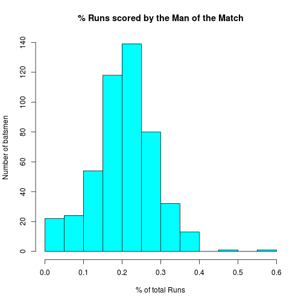

## Why man of the match?

Since the 1980s, at the end of every cricket match, a player is awarded as the 'Man of the Match', similar to the 'MVP' in american football, or the 'three stars' in ice hockey. While it is often given to the most outstanding performer of the winning team, there have been instances when it has been awarded to a player from the losing team, recognising the impact they had on the game. There have also been instances when it was awarded to [entire teams](http://www.espncricinfo.com/wisdenalmanack/content/story/151262.html), because why the hell not, but I digress. 

It's a big deal. For example, in all 60 matches played in the 2018 Indian Premier League, the man of the match *for every game* was awarded 1,00,000 rupees and a trophy.

More importantly, it gives us an objective way of analysing how much impact every player has had on the game, and quantifying who had the most impact. That sounds like an interesting problem to look at.

If you're interested in the 'how', I'll provide a link to the code at the end.
(Quick technical note: I've divided the data for all IPL matches till 2017 into train and test. Looking at individual player performances on a player-match level, it then becomes a classification problem.)

Here's a look at the basic indicators of performance, i.e. how many runs a batsman scored and how many wickets a bowler took:

Rather expectedly, most batsmen who are awarded the Man of the Match score between 50-100 runs. (That tiiiny sliver above 150 came from the very first match where McCullum scored 158.) The average bowler who gets the man of the match gets 2-3 wickets. This is a bar plot of every bowler who has ever bowled in the IPL, so there will be overlaps between these two plots, but this is otherwise pretty much what you would expect. (Another interesting fact: the only two bowlers who have taken 6 wickets in an IPL match are Sohail Tanvir and Adam Zampa.) 

Now, let's consider the other thing you'd immediately guess about the man of the match: that he either took the most wickets in the match or scored the most runs, at least most of the time.

Well, your intuition in this case would be.. kind of right. As you can see, most of the players do fall into either one of those buckets. It also appears, interestingly, that the top scorers win A LOT more often than the top wicket takers. T20 is a batsman's game, after all.

Even more interestingly, there is a significant number of players who are neither the top scorer nor the top wicket taker. There's a certain value T20 and tournaments like the IPL places on the Jadejas and the Kedar Jadhavs, bits-and-pieces players who can do a bit of everything and add balance to the team. Also, sometimes the highest run scorer loses, or is overshadowed by a smaller, more impactful innings. Whatever. The first one sounds cooler.

A much more interesting metric to talk about, actually, would be the *share* of runs scored by a batsman, or the share of wickets in a match taken by a specific bowler. (Actually, that second one's not all that helpful. I checked.) This would, in essence, help in capturing what kind of a match it was - a 40 in a match where only 220 runs were scored in total is much bigger than a 45 in a match where 220 were scored *in the first innings*.

Let's look at *exactly* how helpful that would be, shall we?

Most Men of the Match (?) score around 20-30% of the match runs. That looks usable.
If you train a logistic regression model on the data using all of these features 

(Just to be specific, here's a list:
1. Whether he was on the winnning side
2. Runs scored
3. Wickets taken
4. Runs conceded
5. Flag to indicate if top scorer
6. Flag to indicate if top wicket taker
7. % of the match runs scored by the player
8. Total runs scored in the match
9. Flag to indicate if he was a finisher (not out at the end, on the winnning side)
10. Flag to indicate if >= 2 wickets taken
11. Flag to indicate if > 15 runs scored)

**The F1-score for the model is about 70%.**

Yeeeeup. Looking simply at the macro-level information of a match, like the runs scored and the wickets taken, a simple logistic regression model (or a neural network with a logistic activation function, there's not much difference to justify the increase in computational cost) is able to correctly predict the Man of the Match, 7 times out of 10. That's pretty good. 

But what's it missing?

Let's take an example. One of the interesting cases the model gets wrong is that of [Match 8 in IPL 2011](http://www.espncricinfo.com/series/8048/scorecard/501205/royal-challengers-bangalore-vs-mumbai-indians-8th-match-indian-premier-league-2011). The model flags Ambati Rayudu as the man of the match, while Sachin was given the award in the actual game. Sachin Tendulkar was given the Man of the Match for scoring 55(46), but Ambati Rayudu was there with him till the end scoring 63(50). Interestingly enough, Sachin [shared](http://www.dnaindia.com/sports/report-ipl-4-sachin-tendulkar-shares-his-man-of-the-match-award-with-ambati-rayudu-1531467) the Man of the Match award with Rayudu in that match, saying he deserved it more.

Anyway, let's look at another example. In the 5th match of the first season, David Hussey top-scored for KKR with 38 runs in 45 balls. His bowling figures were 3-0-35-1. In the same match, Murali Kartik took 3 for 17. In this case, the model flagged Kartik as the Man of the Match, but Hussey was awarded.

Or another one. In the [IPL 2015 final](http://www.espncricinfo.com/series/8048/scorecard/829823/mumbai-indians-vs-chennai-super-kings-final-pepsi-indian-premier-league-2015), Lendl Simmons scored 68(45). Rohit Sharma scored 50(26). Neither had any impact with the ball. The model flagged Simmons. Rohit Sharma took home the cheque.

Or another. [Match 40, IPL 2012.](http://www.espncricinfo.com/series/8048/scorecard/548346/mumbai-indians-vs-deccan-chargers-40th-match-indian-premier-league-2012) Lasith Malinga took 4-16. Steyn took 2-10. Steyn was the Man of the Match. [Match 43, IPL 2012.](http://www.espncricinfo.com/series/8048/scorecard/548349/rajasthan-royals-vs-delhi-daredevils-43rd-match-indian-premier-league-2012) Sehwag scored 73(39). Pawan Negi took 4-18. Negi was the Man of the Match.

That, I think, is why predicting the Man of the Match is not as easy as it looks. That is why it cannot be predicted entirely from macro-information.
What the model is missing, then, is **Game Context** - understanding why, sometimes, 2-10 is more impactful than 4-16, and quantifying it. I will work on capturing that in the coming days. Any help or suggestions are greatly appreciated.

